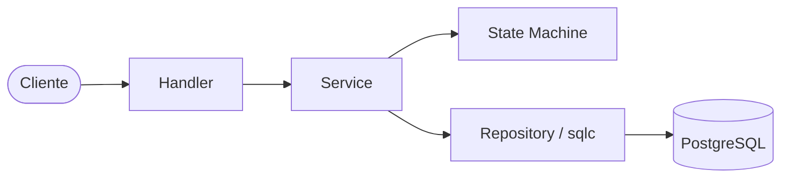
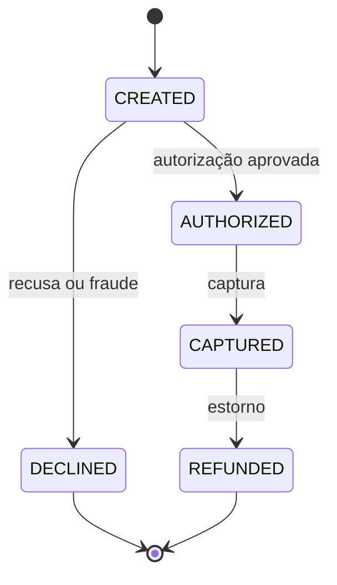

# Payment Gateway Simulator

Um simulador de gateway de pagamentos inspirado em adquirentes como **Stone** e
**Stripe**. A API não se comunica com instituições financeiras reais; ela
modela, de forma enxuta e testável, o ciclo de vida de pagamentos.

## Motivação

O projeto foi criado para demonstrar práticas importantes em sistemas de
pagamento:

- Máquina de estados para transações.
- Idempotência transacional por `Idempotency-Key`.
- Eventos auditáveis e append-only.
- Concorrência controlada em captura e estorno.
- Arquitetura em camadas e persistência com PostgreSQL.
- Contrato OpenAPI e documentação interativa com Swagger UI.

## Tecnologias

| Camada | Tecnologia |
| --- | --- |
| Linguagem | Go 1.25 |
| HTTP | [Chi](https://github.com/go-chi/chi) |
| Banco | PostgreSQL 16 |
| Acesso a dados | [sqlc](https://sqlc.dev/) + pgx |
| Migrations | golang-migrate |
| Logs | `log/slog` |
| Infra | Docker + Docker Compose |
| Documentação | [OpenAPI 3.0](docs/openapi.yaml) + Swagger UI |
| CI | GitHub Actions |

## Arquitetura



- **Handler** traduz HTTP, interpreta JSON e converte erros em respostas da API.
- **Service** orquestra os casos de uso e controla transações de banco.
- **State Machine** valida as mudanças de status permitidas.
- **Authorizer** aplica regras previsíveis de autorização simulada.
- **Repository / sqlc** persiste merchants, terminais, transações, eventos e
  chaves de idempotência.

## Fluxo de pagamento



Ao criar uma transação, o serviço registra o evento `created` e a autoriza.
Cartões de crédito aprovados ficam em `AUTHORIZED`; PIX e débito aprovados são
capturados automaticamente. Cada transição persistida gera um evento.

| Condição | Resultado |
| --- | --- |
| Cartão terminado em `1111` | Aprovado, inclusive acima do limite de fraude |
| Cartão terminado em `0000` | `DECLINED` |
| Valor acima de `10000` | `DECLINED` por antifraude |
| `CREDIT_CARD` aprovado | `AUTHORIZED`; requer captura posterior |
| `PIX` ou `DEBIT_CARD` aprovado | `CAPTURED` automaticamente |

Os valores são inteiros no menor valor da moeda: `1500` representa R$ 15,00.
Os métodos aceitos são `CREDIT_CARD`, `DEBIT_CARD` e `PIX`.

## Idempotência e concorrência

As operações de pagamento exigem o header `Idempotency-Key`:

- `POST /transactions/`
- `POST /transactions/{id}/capture`
- `POST /transactions/{id}/refund`

A chave, a alteração de negócio, os eventos e a resposta JSON são gravados na
mesma transação PostgreSQL. Repetir a mesma chave com a mesma requisição
retorna a resposta original; reutilizá-la com outro payload retorna `409`.

Captura e estorno leem a transação com `FOR UPDATE`, impedindo que duas
requisições concorrentes executem a mesma transição de estado.

## Como executar

### Docker Compose

```bash
cp .env.example .env
docker compose up --build
```

O Compose inicia PostgreSQL, aplica as migrations automaticamente e então sobe
a API em `http://localhost:8080`.

### Localmente

Requer Go 1.25 e PostgreSQL. Configure as variáveis `DB_*` usando
`.env.example`, aplique as migrations com o `golang-migrate` e execute:

```bash
make run
```

### Health check e documentação

```bash
curl http://localhost:8080/health
# {"status":"ok"}
```

- OpenAPI YAML: `http://localhost:8080/openapi.yaml`
- Swagger UI: `http://localhost:8080/swagger/`

## Endpoints

Todas as respostas são JSON. Erros seguem o formato `{"error":"mensagem"}`
e os identificadores são UUIDs.

| Método | Rota | Descrição |
| --- | --- | --- |
| `GET` | `/health`, `/healthz` | Health check |
| `POST` | `/merchants/` | Cria um merchant |
| `GET` | `/merchants/` | Lista merchants |
| `GET` | `/merchants/{id}` | Consulta um merchant |
| `POST` | `/terminals/` | Registra um terminal |
| `GET` | `/terminals/{id}` | Consulta um terminal |
| `POST` | `/terminals/{id}/block` | Bloqueia um terminal |
| `POST` | `/terminals/{id}/activate` | Ativa um terminal |
| `GET` | `/merchants/{merchant_id}/terminals` | Lista terminais do merchant |
| `POST` | `/transactions/` | Cria e autoriza uma transação |
| `GET` | `/transactions/{id}` | Consulta transação e eventos |
| `POST` | `/transactions/{id}/capture` | Captura uma transação autorizada |
| `POST` | `/transactions/{id}/refund` | Estorna uma transação capturada |

### Exemplo de fluxo

```bash
curl -X POST http://localhost:8080/merchants/ \
  -H 'Content-Type: application/json' \
  -d '{"name":"Loja Exemplo"}'
```

```bash
curl -X POST http://localhost:8080/terminals/ \
  -H 'Content-Type: application/json' \
  -d '{"merchant_id":"<MERCHANT_ID>","serial":"STONE-001"}'
```

```bash
curl -X POST http://localhost:8080/transactions/ \
  -H 'Content-Type: application/json' \
  -H 'Idempotency-Key: venda-001' \
  -d '{
    "terminal_serial":"STONE-001",
    "amount":1500,
    "currency":"BRL",
    "payment_method":"CREDIT_CARD",
    "card":"4111111111111111"
  }'
```

```bash
curl -X POST http://localhost:8080/transactions/<TRANSACTION_ID>/capture \
  -H 'Idempotency-Key: captura-001'
```

## Testes

```bash
make test              # unitários e HTTP, com detector de race
make cover             # relatório de cobertura
make test-integration  # Postgres descartável + fluxos ponta a ponta
```

Os testes de integração aplicam migrations em um banco limpo e verificam ciclo
de vida, eventos, rollback, idempotência e capturas concorrentes.

## Melhorias futuras

- Autenticação e escopo por merchant
- Webhooks e filas assíncronas
- Retenção e limpeza de chaves de idempotência
- Conciliação e antifraude mais completa
- Parcelamento
