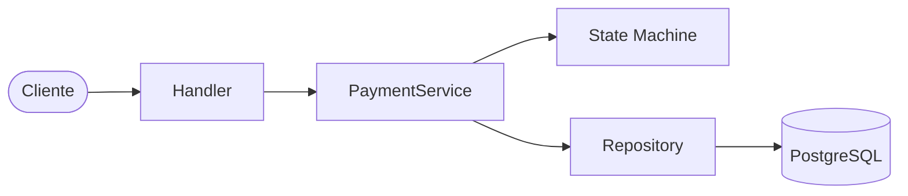
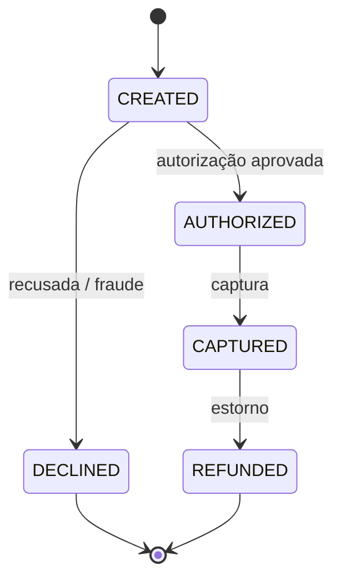

# Payment Gateway Simulator

Um simulador de gateway de pagamentos inspirado em adquirentes como **Stone** e
**Stripe**. Nada conversa com bancos reais — o objetivo é demonstrar, de forma
enxuta e bem arquitetada, os conceitos centrais de um sistema de pagamentos.

> ⚠️ **Projeto em construção.** A configuração base (servidor, Docker, CI) já
> está pronta; os endpoints de domínio estão sendo implementados. Veja o
> [roadmap](#roadmap).

## Motivação

Este projeto foi desenvolvido para demonstrar conceitos comuns em sistemas de
pagamento, com foco em código limpo e testável:

- **Máquina de estados** para o ciclo de vida das transações
- **Idempotência** via `Idempotency-Key` (como em APIs de pagamento reais)
- **Eventos de transação** — toda mudança de estado gera um evento auditável
- **Arquitetura em camadas** (handler → service → state machine → repository)
- **API REST** documentada com Swagger

## Tecnologias

| Camada           | Tecnologia                     |
| ---------------- | ------------------------------ |
| Linguagem        | Go 1.25                        |
| Roteamento HTTP  | [Chi](https://github.com/go-chi/chi) |
| Banco de dados   | PostgreSQL 16                  |
| Acesso a dados   | sqlc (planejado)               |
| Migrations       | golang-migrate (planejado)     |
| Logs             | slog (structured logging)      |
| Testes           | Testify                        |
| Documentação     | Swagger                        |
| Infra            | Docker + Docker Compose        |
| CI               | GitHub Actions                 |

## Arquitetura

Nenhuma regra de negócio vive no handler. O fluxo de uma operação atravessa
camadas com responsabilidades bem definidas:



- **Handler** — traduz HTTP ↔ domínio, valida entrada.
- **Service** — orquestra o caso de uso, delega regras à state machine.
- **State Machine** — decide se uma transição de status é permitida.
- **Repository** — persiste transações, terminais, merchants e eventos.

## Fluxo de pagamento

A estrela do projeto: toda mudança de status passa pela máquina de estados,
que impede transições inválidas (ex.: capturar uma transação já estornada).



Regras de simulação (fake) que tornam o comportamento previsível para testes:

| Condição                     | Resultado                       |
| ---------------------------- | ------------------------------- |
| Valor acima de 10000         | `DECLINED` (fraude)             |
| Cartão terminado em `0000`   | Recusado                        |
| Cartão terminado em `1111`   | Sempre aprovado                 |
| PIX / Débito                 | Aprovado instantaneamente       |
| Crédito                      | `AUTHORIZED` (precisa capturar) |

## Como executar

### Com Docker Compose (recomendado)

```bash
cp .env.example .env
docker compose up --build
```

A API sobe em `http://localhost:8080`.

### Localmente

Requer Go 1.25 e um Postgres acessível (as variáveis de ambiente têm defaults
para desenvolvimento — veja `.env.example`).

```bash
make run        # sobe o servidor
make check      # fmt + vet + testes
make help       # lista todos os alvos
```

### Health check

```bash
curl http://localhost:8080/health
# {"status":"ok"}
```

## Endpoints

> Em implementação. A API seguirá o desenho abaixo:

| Método | Rota                          | Descrição                     |
| ------ | ----------------------------- | ----------------------------- |
| `POST` | `/transactions`               | Cria e autoriza uma transação |
| `GET`  | `/transactions/{id}`          | Consulta transação + eventos  |
| `POST` | `/transactions/{id}/capture`  | Captura uma transação         |
| `POST` | `/transactions/{id}/refund`   | Estorna uma transação         |
| `GET`  | `/health`                     | Health check                  |

## Testes

```bash
make test       # go test -race ./...
make cover      # relatório de cobertura
```

## Roadmap

- [x] Configuração do projeto (servidor, config, Docker, CI)
- [x] Migrations e schema (merchants, terminals, transactions, events, idempotency)
- [x] CRUD de merchants e terminals
- [ ] Máquina de estados e PaymentService
- [ ] Endpoints de captura e estorno
- [ ] Middleware de idempotência
- [ ] Documentação Swagger
- [ ] Cobertura de testes (state machine, service, HTTP)

## Melhorias futuras

- Webhooks reais
- Filas assíncronas
- Conciliação
- Antifraude
- Parcelamento
