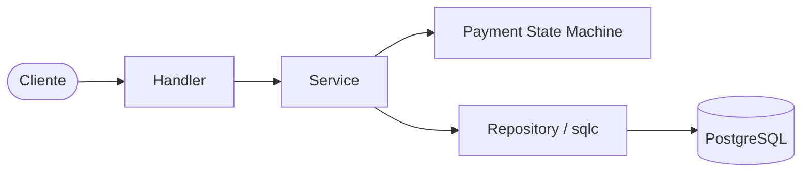
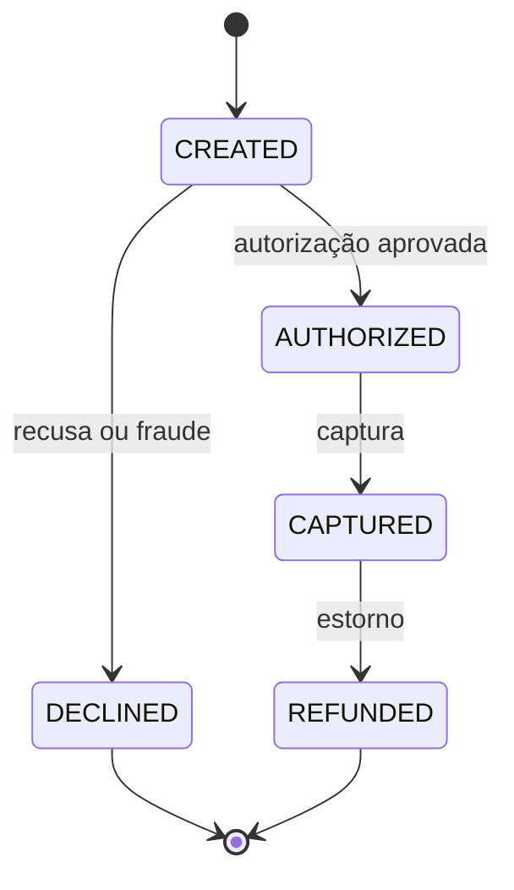

# Payment Gateway Simulator

Um simulador de gateway de pagamentos inspirado em adquirentes como **Stone** e
**Stripe**. Ele não se integra a instituições financeiras: o objetivo é
oferecer uma API pequena, mas realista, para explorar o ciclo de vida de
pagamentos e boas práticas de back-end.

> ⚠️ **Projeto em construção.** CRUD de merchants e terminais, transações,
> autorização simulada, captura, estorno e eventos já estão implementados.
> Uma interface Swagger UI e cobertura de testes ainda são pendências. Veja o
> [roadmap](#roadmap).

## Motivação

Este projeto demonstra conceitos comuns em sistemas de pagamento, com foco em
código limpo, responsabilidades bem separadas e comportamento determinístico
para integrações e testes:

- **Máquina de estados** para o ciclo de vida das transações.
- **Eventos auditáveis**: cada criação ou mudança de estado gera um evento
  persistido.
- **Idempotência transacional** via `Idempotency-Key`, que devolve a resposta
  original sem repetir uma operação de pagamento.
- **Autorização simulada** com regras previsíveis de aprovação, recusa e
  antifraude.
- **Arquitetura em camadas** (`handler → service → state machine → repository`).
- **Transações de banco** para manter a alteração da transação e o seu evento
  consistentes.

## Tecnologias

| Camada | Tecnologia |
| --- | --- |
| Linguagem | Go 1.25 |
| Roteamento HTTP | [Chi](https://github.com/go-chi/chi) |
| Banco de dados | PostgreSQL 16 |
| Acesso a dados | [sqlc](https://sqlc.dev/) + pgx |
| Schema | Migrations SQL versionadas |
| Logs | `log/slog` |
| Infra | Docker + Docker Compose |
| Documentação | [OpenAPI 3.0](docs/openapi.yaml) |
| CI | GitHub Actions (`fmt`, `vet`, testes e build) |

## Arquitetura

Nenhuma regra de negócio vive no handler. O fluxo de uma operação atravessa
camadas com responsabilidades bem definidas:



- **Handler** — traduz HTTP para o domínio, interpreta JSON e converte erros
  conhecidos em respostas HTTP.
- **Service** — orquestra os casos de uso e delimita transações de banco.
- **State Machine** — valida as transições de status permitidas.
- **Authorizer** — aplica as regras fake de autorização e gera o código de
  autorização quando aplicável.
- **Repository / sqlc** — executa as consultas e persiste merchants, terminais,
  transações e eventos.

## Fluxo de pagamento

Toda mudança de status passa pela máquina de estados; por exemplo, não é
possível capturar uma transação estornada ou autorizar uma transação recusada.



Ao criar uma transação, o serviço registra o evento `created` e tenta
autorizá-la. Uma transação de cartão de crédito aprovada fica em `AUTHORIZED`;
PIX e cartão de débito aprovados são capturados imediatamente. Capturas,
estornos e recusas também geram eventos, disponíveis na consulta da transação.

Regras de simulação:

| Condição | Resultado |
| --- | --- |
| Cartão terminado em `1111` | Aprovado, inclusive acima do limite de fraude |
| Cartão terminado em `0000` | `DECLINED` |
| Valor acima de `10000` | `DECLINED` por antifraude |
| Demais casos | Aprovado |
| Método `CREDIT_CARD` aprovado | `AUTHORIZED`; requer captura posterior |
| Método `PIX` ou `DEBIT_CARD` aprovado | `CAPTURED` automaticamente |

Os valores são inteiros; por convenção, envie o menor valor da moeda (por
exemplo, `1500` para R$ 15,00). Os métodos aceitos são `CREDIT_CARD`,
`DEBIT_CARD` e `PIX`.

## Como executar

### Com Docker Compose (recomendado)

1. Crie o arquivo de configuração:

   ```bash
   cp .env.example .env
   ```

2. Suba o PostgreSQL e aplique as migrations, na ordem abaixo. As migrations
   **não são executadas automaticamente** pelo Compose neste momento:

   ```bash
   docker compose up -d db
   docker compose exec -T db psql -U pgsim -d pgsim < migrations/000001_create_payment_core.up.sql
   docker compose exec -T db psql -U pgsim -d pgsim < migrations/000002_create_triggers.up.sql
   docker compose exec -T db psql -U pgsim -d pgsim < migrations/000003_add_columns_to_idempotency_keys_table.up.sql
   docker compose exec -T db psql -U pgsim -d pgsim < migrations/000004_make_idempotency_status_code_required.up.sql
   ```

3. Suba a API:

   ```bash
   docker compose up --build app
   ```

A API fica disponível em `http://localhost:8080`.

> No PowerShell, substitua o redirecionamento das migrations por:
> `Get-Content migrations/000001_create_payment_core.up.sql | docker compose exec -T db psql -U pgsim -d pgsim`
> e repita, em ordem, para cada migration `.up.sql`.

### Localmente

Requer Go 1.25 e um PostgreSQL acessível. Copie `.env.example` para `.env`,
ajuste as variáveis `DB_*`, aplique as migrations com um cliente PostgreSQL e
então execute:

```bash
make run        # inicia o servidor
make check      # fmt-check + vet + testes
make help       # lista todos os alvos
```

### Health check

```bash
curl http://localhost:8080/health
# {"status":"ok"}
```

`GET /healthz` é um alias do health check.

## Endpoints

Todas as respostas são JSON. Erros seguem o formato `{"error":"mensagem"}`.
Os identificadores são UUIDs. As operações `POST /transactions/`, captura e
estorno exigem o header `Idempotency-Key`; repetir a mesma chave e a mesma
requisição devolve a resposta original sem executar a operação novamente.

| Método | Rota | Descrição |
| --- | --- | --- |
| `POST` | `/merchants/` | Cria um merchant |
| `GET` | `/merchants/` | Lista merchants |
| `GET` | `/merchants/{id}` | Consulta um merchant |
| `POST` | `/terminals/` | Registra um terminal para um merchant |
| `GET` | `/terminals/{id}` | Consulta um terminal |
| `POST` | `/terminals/{id}/block` | Bloqueia um terminal |
| `POST` | `/terminals/{id}/activate` | Ativa um terminal |
| `GET` | `/merchants/{merchant_id}/terminals` | Lista os terminais do merchant |
| `POST` | `/transactions/` | Cria e autoriza uma transação |
| `GET` | `/transactions/{id}` | Consulta a transação e seu histórico de eventos |
| `POST` | `/transactions/{id}/capture` | Captura uma transação `AUTHORIZED` |
| `POST` | `/transactions/{id}/refund` | Estorna uma transação `CAPTURED` |
| `GET` | `/health` ou `/healthz` | Health check do processo |

### Exemplo de fluxo

Crie um merchant e guarde o campo `id` retornado:

```bash
curl -X POST http://localhost:8080/merchants/ \
  -H 'Content-Type: application/json' \
  -d '{"name":"Loja Exemplo"}'
```

Registre um terminal usando o UUID do merchant:

```bash
curl -X POST http://localhost:8080/terminals/ \
  -H 'Content-Type: application/json' \
  -d '{"merchant_id":"<MERCHANT_ID>","serial":"STONE-001"}'
```

Crie uma venda de crédito. Com o cartão terminado em `1111`, o retorno terá
status `AUTHORIZED`:

```bash
curl -X POST http://localhost:8080/transactions/ \
  -H 'Content-Type: application/json' \
  -H 'Idempotency-Key: venda-001' \
  -d '{
    "terminal_serial":"STONE-001",
    "amount":1500,
    "currency":"BRL",
    "payment_method":"CREDIT_CARD",
    "card":"4111111111111111"
  }'
```

Capture a transação com o UUID retornado:

```bash
curl -X POST http://localhost:8080/transactions/<TRANSACTION_ID>/capture \
  -H 'Idempotency-Key: captura-001'
```

Para uma venda PIX ou débito, informe `PIX` ou `DEBIT_CARD`; uma autorização
aprovada já retorna a transação como `CAPTURED`. Consulte `GET
/transactions/{id}` para obter a transação e a lista cronológica de eventos.

## Testes

```bash
make test       # go test -race -count=1 ./...
make cover      # gera e exibe o relatório de cobertura
make test-integration # sobe um Postgres descartável e testa fluxos de pagamento
```

O CI executa verificação de formatação, `go vet`, testes com detector de race e
build a cada push e pull request para `main`.

Os testes de integração usam Docker Compose, aplicam as migrations em um banco
novo e cobrem o ciclo de vida da transação, eventos, rollback, idempotência e
capturas concorrentes.

## Roadmap

- [x] Configuração do projeto (servidor, config, Docker, CI)
- [x] Migrations e schema (merchants, terminals, transactions, events, idempotency)
- [x] CRUD de merchants e terminals
- [x] Máquina de estados e TransactionService
- [x] Autorização fake e registro de eventos
- [x] Endpoints de captura e estorno
- [x] Execução automática das migrations
- [x] Idempotência transacional com `Idempotency-Key`
- [x] Especificação OpenAPI 3.0
- [x] Interface Swagger UI
- [ ] Cobertura de testes de state machine, service e HTTP

## Melhorias futuras

- Webhooks reais
- Filas assíncronas
- Conciliação
- Antifraude mais completa
- Parcelamento
